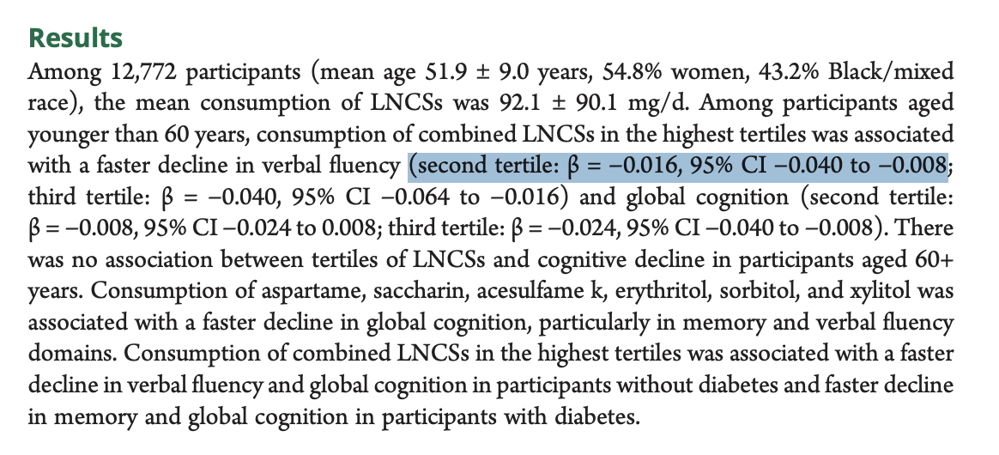
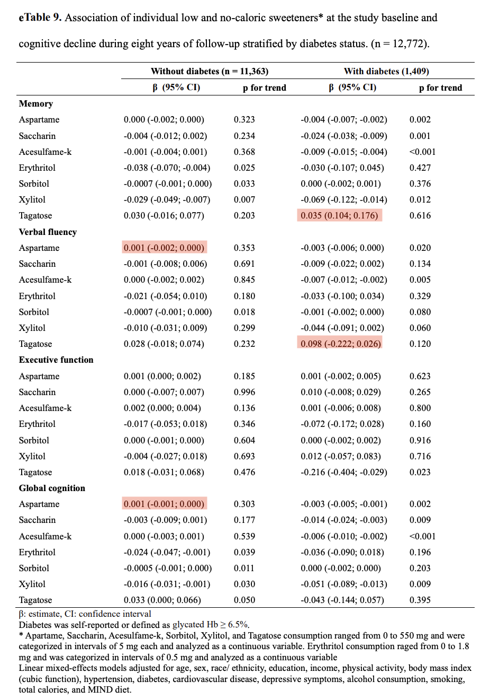
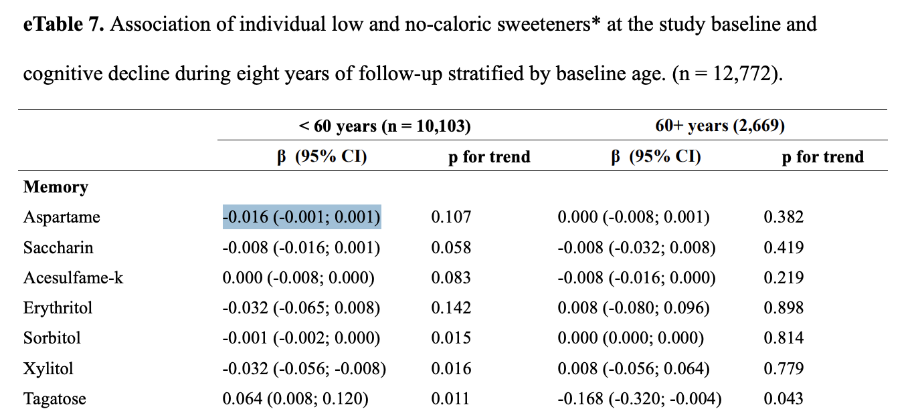
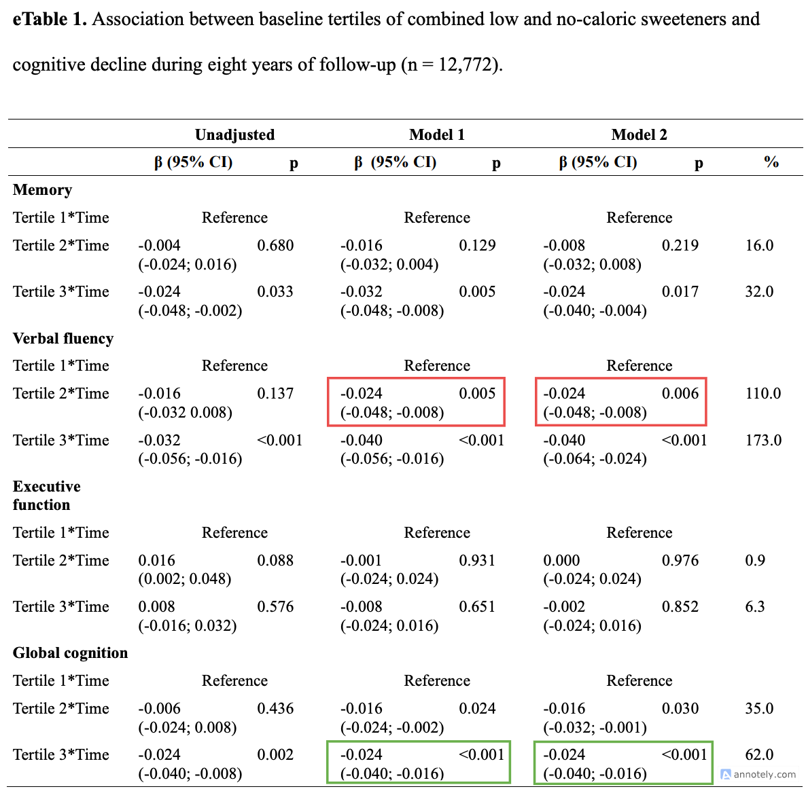
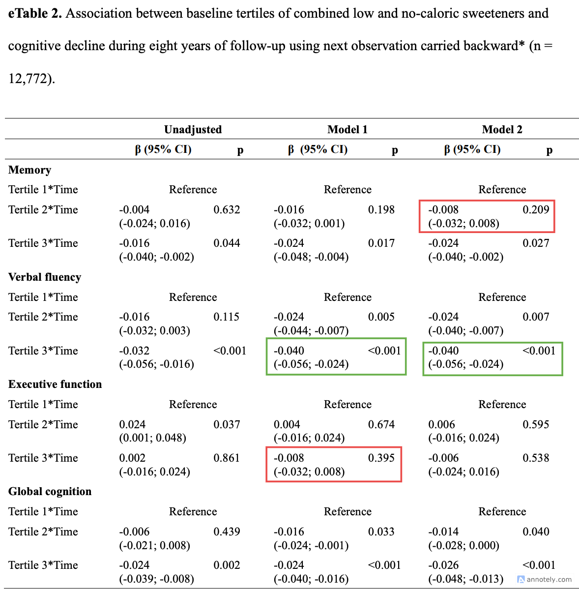
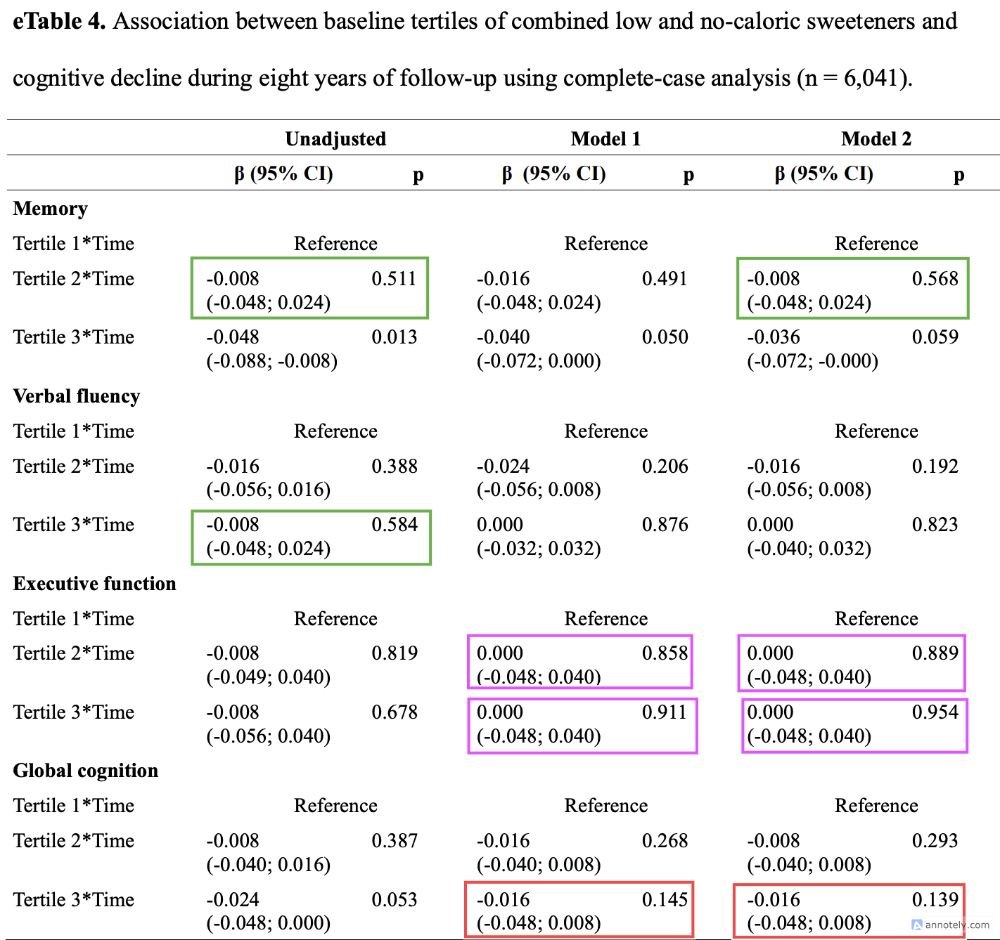
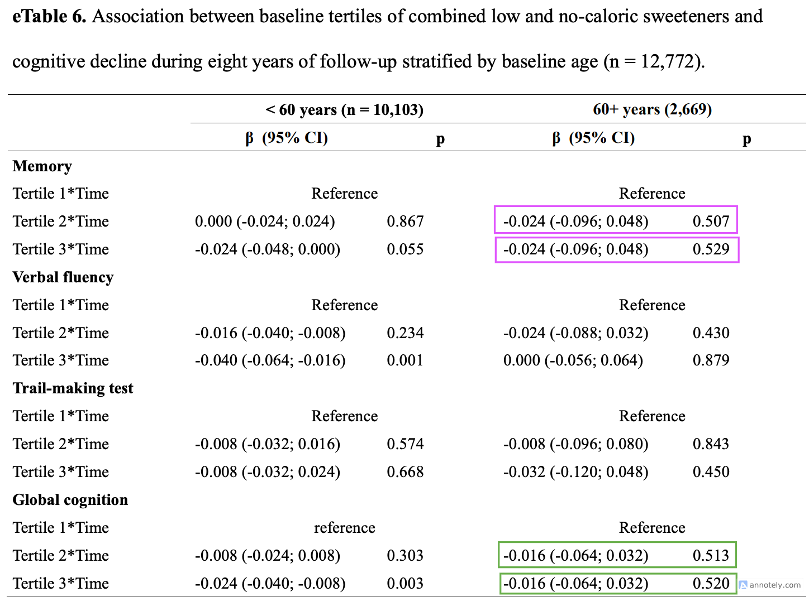
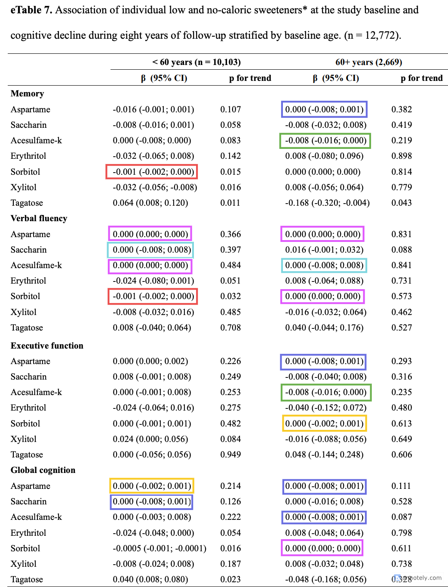
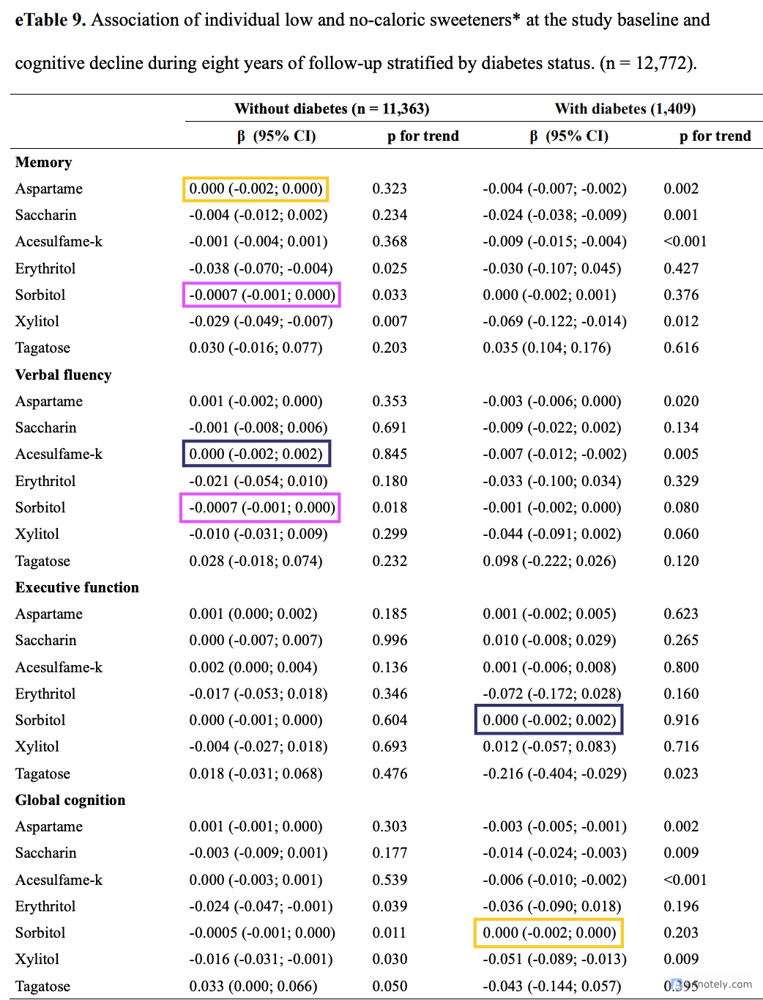
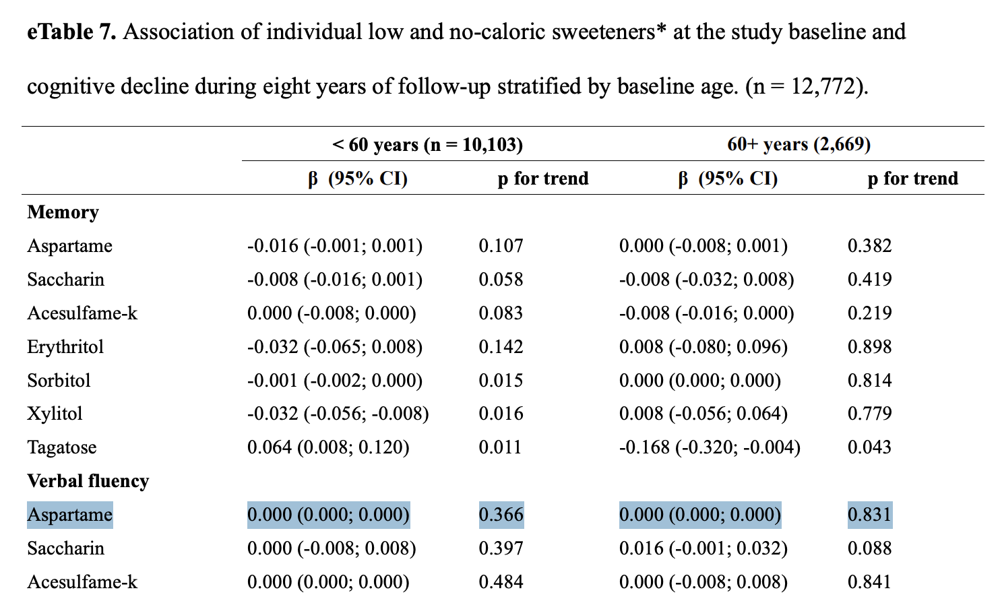

Errors and inconsistencies in quantiative results reported in Gonçalves
et al. (2025)
================
Sophie E. Hill
2025-09-06

- [Example](#example)
- [Summary](#summary)
- [Context](#context)
- [1. Estimates outside confidence
  interval](#1-estimates-outside-confidence-interval)
- [2. Duplicate values](#2-duplicate-values)
- [3. Asymmetric confidence
  intervals](#3-asymmetric-confidence-intervals)
- [4. Inconsistent rounding](#4-inconsistent-rounding)
- [5. Frequent multiples of 0.008](#5-frequent-multiples-of-0008)
- [Conclusions](#conclusions)

This post identifies a number of errors and inconsistencies in the
quantitative results presented in [this
paper](https://www.neurology.org/doi/10.1212/WNL.0000000000214023),
which claims to find a relationship between consumption of low- and
no-calorie sweeteners (LNCS) and cognitive decline:

> Gonçalves, Natalia Gomes, Euridice Martinez-Steele, Paulo A. Lotufo,
> et al. ‘Association Between Consumption of Low- and No-Calorie
> Artificial Sweeteners and Cognitive Decline’. Neurology 105, no. 7
> (2025): e214023. <https://doi.org/10.1212/WNL.0000000000214023>.

<br>


<br> <br>

## Example

For example, consider this estimate, reported in the abstract on page 1:



> “Among participants aged younger than 60 years, consumption of
> combined LNCSs in the highest tertiles was associated with a faster
> decline in verbal fluency (second tertile: **β = −0.016, 95% CI −0.040
> to −0.008** …”

It is immediately obvious that the confidence interval
$(-0.040, -0.008)$ is not centred around the point estimate $(-0.016)$.

``` r
(-0.040 + -0.008)/2
```

    ## [1] -0.024

Perhaps it is a typo. Let’s look up this value in appendix eTable 6:

<br>


<br> <br>

:white_check_mark: The values for the estimate and confidence interval
match.

*But* now we can see another issue…

The 95% confidence interval does not cover 0, so the p-value must be
$<0.05$, by definition.

However, the value reported here is $p = 0.234$.

That is such a large discrepancy that it cannot be explained as a
rounding error.

In fact, there is a more obvious, though concerning, explanation.

If we change the upper bound of the confidence interval from $-0.008$ to
$+0.008$, then the estimate is now correctly centred:

``` r
(-0.040 + 0.008)/2
```

    ## [1] -0.016

Since the confidence interval takes the form
$CI = Estimate \pm (1.96 \times SE)$, we can back out the standard error
like this:

``` r
ci_lower <- -0.040
ci_upper <- 0.008
se <- (ci_upper - ci_lower)/(2*1.96)
se
```

    ## [1] 0.0122449

With this value, we can calculate the p-value directly:

``` r
est <- -0.016
z <- abs(est / se)
p <- 2 * (1 - pnorm(z))
p
```

    ## [1] 0.1913259

This gives us $p = 0.191$, much closer to the value reported in the
table of $p = 0.234$.

(We would not expect the values to match exactly since the confidence
intervals are only reported to 3 decimal places and this will introduce
rounding errors in the computation of the p-value.)

*In other words: one of the key estimates presented in this paper likely
contains a typo in its confidence interval. Rather than being evidence
of an association between sweeteners and cognitive decline, as claimed
in the text, it is not statistically significant.*

## Summary

Unfortunately, this example is not an isolated issue.

Across 9 appendix tables with 256 regression coefficients, I find:

- **5** cases of **estimates outside their reported confidence
  interval**
- **46 duplicates** (i.e. estimate/CI combinations with an identical
  match in the same table)
- At least **20 cases** of **asymmetric confidence intervals**, which
  cannot be explained as rounding errors
- **17 values rounded to 4 decimal places** (all others to 3 decimal
  places), indicating manual editing of tables
- Over **50%** of all estimates and confidence intervals are **multiples
  of 0.008**

It is difficult to diagnose exactly what is going on without access to
the underlying data and code.

However, two broad conclusions can be drawn:

1.  There are many **errors and inconsistencies** in the results which
    appear to be the result of manual editing.
2.  There are **strange patterns** in the results which, if genuine,
    should have been noted and explained by the authors.

## Context

The replication materials, including the underlying data and code for
their analyses, are not available. So my comments are based only on the
results presented in the paper and the appendix.

In order to examine the results systematically, I extracted two
datasets:

1.  CSV of all estimates cited in the main text (64 estimates):
    `paper_text_estimates.csv`
2.  CSV of all regression tables in the appendix (9 tables, 256
    estimates): `appendix_tables.csv`

Both datasets are available in this repo. (Note that both were created
with LLM-aided extraction, so there may be errors. Always check values
against the paper or appendix pdf.)

The first dataset contains estimates and confidence intervals cited in
the main text of the paper in this format $(\beta = −0.016$, 95% CI
$−0.040$ to $−0.008)$, along with the page number.

The second dataset contains estimates, confidence intervals, and
p-values from all 9 tables in the appendix (labelled “eTable 1”, “eTable
2”, etc.).

The tables report results from different specifications of the core
model, where the explanatory variable is consumption of sweeteners
interacted with a time variable and the outcome is a measure of
cognitive health, on various subsets of the data.

**Explanatory variables:**

- Categorical variable for tertiles of total LNCS consumption in mg
- Binary variable for daily LNCS consumption (vs no/sporadic
  consumption)
- Continuous variable of individual LNCS consumption in mg

**Outcome variables:**

- Memory (z-score of memory tests)
- Verbal fluency (z-score average of phonemic and semantic verbal
  fluency tests)
- Executive function (z-score of Trail-Making Test B)
- Global Cogition (composite score)

**Subsets:**

- Full sample (n = 12,772)
- Complete cases (n = 6,041)
- Under/over 60s (n = 10,103 / n = 2,669)
- Without/with diabetes (n = 11,363 / n = 1,409)

**Models:**

- Unadjusted
- Model 1 (including age, sex, race/ ethnicity, education, and income)
- Model 2 (including Model 1 + physical activity, body mass index (cubic
  function), hypertension, diabetes, cardiovascular disease, depressive
  symptoms, alcohol consumption, smoking, total calories, and MIND diet)

## 1. Estimates outside confidence interval

I have identified **5 cases** in the appendix tables (9 tables, 256
estimates) where the estimates lies outside its reported confidence
interval:

``` r
dat |> 
  filter(est < ci_lower | est > ci_upper) |>
  select(table_id, model, outcome, subset, var, 
         est, ci_lower, ci_upper)
```

    ##   table_id model outcome subset       var    est ci_lower ci_upper
    ## 1        7 Mod 2       M    <60 Aspartame -0.016   -0.001    0.001
    ## 2        9 Mod 2       M   w db  Tagatose  0.035    0.104    0.176
    ## 3        9 Mod 2      VF w/o db Aspartame  0.001   -0.002    0.000
    ## 4        9 Mod 2      VF   w db  Tagatose  0.098   -0.222    0.026
    ## 5        9 Mod 2      GC w/o db Aspartame  0.001   -0.001    0.000

The estimates in rows 2-5 all come from eTable 9 and likely represent
sign errors. This is clearest for the estimates from rows 2 and 4 since
they have larger values:

- $0.035$ $(0.104, 0.176)$ $\rightarrow$ the lower bound should be
  $-0.104$
- $0.098$ $(-0.222, 0.026)$ $\rightarrow$ the estimate should be
  $-0.098$

``` r
(-0.104 + 0.176)/2
```

    ## [1] 0.036

``` r
(-0.222 + 0.026)/2
```

    ## [1] -0.098

Rows 3 and 5 are probably also sign errors, though it’s harder to tell
with these values:

- $0.001$ $(-0.002, 0.000)$
- $0.001$ $(-0.001, 0.000)$



<br> <br>

Row 1 is harder to diagnose. This is the coefficient for Aspartame on
Memory among the \<60s in eTable 7:

$-0.016$ $(-0.001, 0.001)$

All the coefficients for Aspartame on the other outcome variables in
this table are 0.000.



<br> <br>

There is also **1 case** where an estimate cited in the paper lies
outside its confidence interval (p.6):

> “Figure 3 shows the association between individual LNCS consumption
> and cognitive decline. There was a faster rate of decline in memory,
> verbal fluency, and global cognitive with higher consumption of …
> sorbitol (memory: β = −0.001, 95% CI −0.001 to −0.0001; verbal
> fluency: β = −0.0008, 95% CI −0.001 to −0.0003; global cognition: **β
> = −0.0006, 95% CI −0.001 to −0.002**), … (Figure 3 and eTable 5)”

Clearly this is a typo, since the confidence interval as written is
backwards: $(−0.001$, $−0.002)$ Checking against eTable 5 in the
appendix, we can see that the CI upper bound was mistranscribed in the
paper.

The correct values are: $-0.0006$ $(-0.001; -0.0002)$

**Mini summary**

:triangular_flag_on_post: 6 problematic cases identified, of which:

- 5 likely typos
- 1 unexplained

## 2. Duplicate values

Many of the tables contain identical estimates and CIs.

Defining duplicates as rows where `(estimate, ci_lower, ci_upper)` has
an identical match within the same table, there are **46 duplicates**.

6 out of the 9 tables contain duplicate values (eTables 1, 2, 4, 6, 7,
9).

eTable 7 has a particularly large proportion of duplicates
($\frac{19}{56} = 34\%$ of all estimates in the table).

    ## Number of duplicated est/CIs, by table:

    ##   table_id  n
    ## 1        1  4
    ## 2        2  4
    ## 3        4  9
    ## 4        6  4
    ## 5        7 19
    ## 6        9  6

    ## Duplicated est/CIs:

    ##    id model outcome   subset          var     est ci_lower ci_upper     p
    ## 1   1 Mod 1      VF      All      T2*Time -0.0240   -0.048   -0.008 0.005
    ## 2   1 Mod 2      VF      All      T2*Time -0.0240   -0.048   -0.008 0.006
    ## 3   1 Mod 1      GC      All      T3*Time -0.0240   -0.040   -0.016 0.001
    ## 4   1 Mod 2      GC      All      T3*Time -0.0240   -0.040   -0.016 0.001
    ## 5   2 Mod 1      VF      All      T3*Time -0.0400   -0.056   -0.024 0.001
    ## 6   2 Mod 2      VF      All      T3*Time -0.0400   -0.056   -0.024 0.001
    ## 7   2 Mod 1      EF      All      T3*Time -0.0080   -0.032    0.008 0.395
    ## 8   2 Mod 2       M      All      T2*Time -0.0080   -0.032    0.008 0.209
    ## 9   4 Mod 1      GC Complete      T3*Time -0.0160   -0.048    0.008 0.145
    ## 10  4 Mod 2      GC Complete      T3*Time -0.0160   -0.048    0.008 0.139
    ## 11  4 Unadj       M Complete      T2*Time -0.0080   -0.048    0.024 0.511
    ## 12  4 Unadj      VF Complete      T3*Time -0.0080   -0.048    0.024 0.584
    ## 13  4 Mod 2       M Complete      T2*Time -0.0080   -0.048    0.024 0.568
    ## 14  4 Mod 1      EF Complete      T2*Time  0.0000   -0.048    0.040 0.858
    ## 15  4 Mod 1      EF Complete      T3*Time  0.0000   -0.048    0.040 0.911
    ## 16  4 Mod 2      EF Complete      T2*Time  0.0000   -0.048    0.040 0.889
    ## 17  4 Mod 2      EF Complete      T3*Time  0.0000   -0.048    0.040 0.954
    ## 18  6 Mod 2       M      60+      T2*Time -0.0240   -0.096    0.048 0.507
    ## 19  6 Mod 2       M      60+      T3*Time -0.0240   -0.096    0.048 0.529
    ## 20  6 Mod 2      GC      60+      T2*Time -0.0160   -0.064    0.032 0.513
    ## 21  6 Mod 2      GC      60+      T3*Time -0.0160   -0.064    0.032 0.520
    ## 22  7 Mod 2       M      60+ Acesulfame-k -0.0080   -0.016    0.000 0.219
    ## 23  7 Mod 2      EF      60+ Acesulfame-k -0.0080   -0.016    0.000 0.235
    ## 24  7 Mod 2       M      <60     Sorbitol -0.0010   -0.002    0.000 0.015
    ## 25  7 Mod 2      VF      <60     Sorbitol -0.0010   -0.002    0.000 0.032
    ## 26  7 Mod 2       M      60+    Aspartame  0.0000   -0.008    0.001 0.382
    ## 27  7 Mod 2      EF      60+    Aspartame  0.0000   -0.008    0.001 0.293
    ## 28  7 Mod 2      GC      60+    Aspartame  0.0000   -0.008    0.001 0.111
    ## 29  7 Mod 2      GC      <60    Saccharin  0.0000   -0.008    0.001 0.126
    ## 30  7 Mod 2      GC      60+ Acesulfame-k  0.0000   -0.008    0.001 0.087
    ## 31  7 Mod 2      VF      <60    Saccharin  0.0000   -0.008    0.008 0.397
    ## 32  7 Mod 2      VF      60+ Acesulfame-k  0.0000   -0.008    0.008 0.841
    ## 33  7 Mod 2      EF      60+     Sorbitol  0.0000   -0.002    0.001 0.613
    ## 34  7 Mod 2      GC      <60    Aspartame  0.0000   -0.002    0.001 0.214
    ## 35  7 Mod 2       M      60+     Sorbitol  0.0000    0.000    0.000 0.814
    ## 36  7 Mod 2      VF      <60    Aspartame  0.0000    0.000    0.000 0.366
    ## 37  7 Mod 2      VF      60+    Aspartame  0.0000    0.000    0.000 0.831
    ## 38  7 Mod 2      VF      <60 Acesulfame-k  0.0000    0.000    0.000 0.484
    ## 39  7 Mod 2      VF      60+     Sorbitol  0.0000    0.000    0.000 0.573
    ## 40  7 Mod 2      GC      60+     Sorbitol  0.0000    0.000    0.000 0.611
    ## 41  9 Mod 2       M   w/o db     Sorbitol -0.0007   -0.001    0.000 0.033
    ## 42  9 Mod 2      VF   w/o db     Sorbitol -0.0007   -0.001    0.000 0.018
    ## 43  9 Mod 2       M   w/o db    Aspartame  0.0000   -0.002    0.000 0.323
    ## 44  9 Mod 2      GC     w db     Sorbitol  0.0000   -0.002    0.000 0.203
    ## 45  9 Mod 2      VF   w/o db Acesulfame-k  0.0000   -0.002    0.002 0.845
    ## 46  9 Mod 2      EF     w db     Sorbitol  0.0000   -0.002    0.002 0.916

It is useful to highlight the duplicates on the original tables to see
where they occur.

<br>



<br> <br>



<br> <br>



<br> <br>



<br> <br>



<br> <br>



<br>

## 3. Asymmetric confidence intervals

While confidence intervals can be asymmetric in some contexts
(e.g. bootstrapping, log-transformations), there is no indication in the
paper that those contexts are relevant here. The tables present results
from “linear mixed-effects models”, with estimates and 95% confidence
intervals.

So we expect the confidence intervals here to be symmetric around their
point estimates.

However, even accounting for rounding errors, we can find many examples
of asymmetric confidence intervals.

We have already found one obvious example in the abstract of the paper.


But it is easy to find more.

For example, we can filter the data to find estimates that do not match
the middle of the confidence interval but have the same absolute value.
These are clearly more sign errors:

    ##   table_id model outcome subset       var    est ci_mid ci_lower ci_upper
    ## 1        7 Mod 2      VF    60+   Xylitol -0.016  0.016   -0.032    0.064
    ## 2        9 Mod 2      VF w/o db Aspartame  0.001 -0.001   -0.002    0.000
    ## 3        9 Mod 2      VF   w db  Tagatose  0.098 -0.098   -0.222    0.026

Note: the estimate for Tagatose on Verbal fluency in Table 9 was already
identified as problematic in Section 1, since here the sign error means
that the estimate $(0.098)$ is outside its confidence interval
$(-0.222, 0.026)$.

However, we have now found two more problematic cases. These estimates
are within their confidence intervals but have the wrong sign.

Next, let’s look for more cases like the one in the abstract, where the
confidence interval *would* be symmetric if one of the bounds changed
sign.

To do this, let’s filter the data to cases where the estimate has the
same absolute value as the middle of the amended confidence interval
(where one bound has flipped sign).

``` r
dat |>
  mutate(
    ci_mid2 = (ci_lower - ci_upper)/2
    ) |>
  filter(!(est == ci_mid)) |>
  filter(abs(est) == abs(ci_mid2)) |>
  select(table_id, model, outcome, subset, var, est, ci_mid, ci_mid2, ci_lower, ci_upper) |>
  as.data.frame()
```

    ##   table_id model outcome subset       var    est ci_mid ci_mid2 ci_lower
    ## 1        5 Mod 2      VF    All Saccharin -0.005 -0.003  -0.005   -0.008
    ## 2        6 Mod 2      VF    <60   T2*Time -0.016 -0.024  -0.016   -0.040
    ## 3        9 Mod 2      VF w/o db Aspartame  0.001 -0.001  -0.001   -0.002
    ##   ci_upper
    ## 1    0.002
    ## 2   -0.008
    ## 3    0.000

We have found two more examples in addition to the estimate of $-0.016$
from the abstract.

- Original: $-0.005$ $(-0.008, 0.002)$
- Amended: $-0.005$ $(-0.008, -0.002)$

``` r
(-0.008 + -0.002)/2
```

    ## [1] -0.005

- Original: $0.001$ $(-0.002, 0.000)$
- Amended: $0.001$ $(0.002, 0.000)$

``` r
(0.002 + 0.000)/2
```

    ## [1] 0.001

How many other estimates have asymmetric confidence intervals? It
depends on how much tolerance we allow for rounding errors.

    ## Number of estimates more than 0 from CI mid:  170

    ## Number of estimates more than 0.001 from CI mid:  102

    ## Number of estimates more than 0.002 from CI mid:  79

    ## Number of estimates more than 0.003 from CI mid:  73

    ## Number of estimates more than 0.004 from CI mid:  20

Recall that almost all values in the tables are presented to 3 decimal
places.

Let’s focus on examples that are unlikely to be attributable to rounding
errors. Here are 20 cases where the difference between the estimate and
the middle of the confidence interval is greater than 0.004:

    ## Cases where abs(est - ci_mid) > 0.004:

    ##    id model outcome   subset        var    est  ci_mid   diff ci_lower ci_upper
    ## 1   9 Mod 2      VF     w db   Tagatose  0.098 -0.0980 0.1960   -0.222    0.026
    ## 2   9 Mod 2       M     w db   Tagatose  0.035  0.1400 0.1050    0.104    0.176
    ## 3   7 Mod 2      VF      60+    Xylitol -0.016  0.0160 0.0320   -0.032    0.064
    ## 4   7 Mod 2      VF      60+   Tagatose  0.040  0.0660 0.0260   -0.044    0.176
    ## 5   8 Mod 2       M     w db    T2*Time -0.069 -0.0495 0.0195   -0.093   -0.006
    ## 6   7 Mod 2       M      <60  Aspartame -0.016  0.0000 0.0160   -0.001    0.001
    ## 7   7 Mod 2      VF      <60 Erythritol -0.024 -0.0395 0.0155   -0.080    0.001
    ## 8   1 Unadj      EF      All    T2*Time  0.016  0.0250 0.0090    0.002    0.048
    ## 9   4 Mod 2      VF Complete    T2*Time -0.016 -0.0240 0.0080   -0.056    0.008
    ## 10  4 Mod 2      GC Complete    T2*Time -0.008 -0.0160 0.0080   -0.040    0.008
    ## 11  6 Mod 2      VF      <60    T2*Time -0.016 -0.0240 0.0080   -0.040   -0.008
    ## 12  7 Mod 2      EF      60+  Saccharin -0.008 -0.0160 0.0080   -0.040    0.008
    ## 13  7 Mod 2      GC      60+   Tagatose -0.048 -0.0560 0.0080   -0.168    0.056
    ## 14  7 Mod 2       M      60+   Tagatose -0.168 -0.1620 0.0060   -0.320   -0.004
    ## 15  2 Unadj       M      All    T3*Time -0.016 -0.0210 0.0050   -0.040   -0.002
    ## 16  2 Mod 2      GC      All    T3*Time -0.026 -0.0305 0.0045   -0.048   -0.013
    ## 17  7 Mod 2      EF      <60  Saccharin  0.008  0.0035 0.0045   -0.001    0.008
    ## 18  5 Mod 2       M      All   Tagatose  0.032  0.0365 0.0045   -0.008    0.081
    ## 19  1 Mod 1      VF      All    T3*Time -0.040 -0.0360 0.0040   -0.056   -0.016
    ## 20  4 Mod 1       M Complete    T3*Time -0.040 -0.0360 0.0040   -0.072    0.000

## 4. Inconsistent rounding

Numerical values presented in the text of the paper and in the appendix
tables are rounded inconsistently. The majority of the values are given
to 3 decimal places, but a small number are given to 4 instead.

    ## Number of decimal places reported for estimates, CIs, and p-values:

    ##       type decimals   n
    ## 1 ci_lower        3 256
    ## 2 ci_lower        4   0
    ## 3 ci_upper        3 247
    ## 4 ci_upper        4   9
    ## 5      est        3 248
    ## 6      est        4   8
    ## 7        p        3 256
    ## 8        p        4   0

We can see the majority of the 4dp values occur in eTable 5:

    ## Rows with some values to 4dps:

    ##    table_id outcome est_char ci_lower_char ci_upper_char     p
    ## 1         5       M   -0.002        -0.003       -0.0004 0.005
    ## 2         5       M   -0.001        -0.001       -0.0001 0.009
    ## 3         5      VF   -0.001        -0.002       -0.0001 0.038
    ## 4         5      VF   -0.002        -0.004        0.0003 0.095
    ## 5         5      VF  -0.0008        -0.001       -0.0003 0.002
    ## 6         5      EF   0.0004        -0.006         0.008 0.889
    ## 7         5      EF  -0.0002        -0.001        0.0004 0.443
    ## 8         5      GC   -0.001        -0.002       -0.0004 0.004
    ## 9         5      GC  -0.0006        -0.001       -0.0002 0.002
    ## 10        7      GC  -0.0005        -0.001       -0.0001 0.016
    ## 11        9       M  -0.0007        -0.001         0.000 0.033
    ## 12        9      VF  -0.0007        -0.001         0.000 0.018
    ## 13        9      GC  -0.0005        -0.001         0.000 0.011

Why were some values rounded to 4dp? It seems that these were cases
where:

- the estimate was cited directly in the text of the paper
- 4dp were necessary to remove ambiguity or confusion

For example, see this paragraph from the paper (4dp values in bold):

> Figure 3 shows the association between individual LNCS consumption and
> cognitive decline. There was a faster rate of decline in memory,
> verbal fluency, and global cognitive with higher consumption of
> aspartame (memory: β = −0.002, 95% CI −0.003 to **−0.0004**, verbal
> fluency: β = −0.001, 95% CI −0.002 to **−0.0001**, global cognition: β
> = −0.001, 95% CI −0.002 to **−0.0004**), saccharin (memory: β =
> −0.010, 95% CI −0.016 to −0.003, verbal fluency: β = −0.005, 95% CI
> −0.008 to −0.002, global cognition: β = −0.008, 95% CI −0.011 to
> −0.002), sorbitol (memory: β = −0.001, 95% CI −0.001 to **−0.0001**;
> verbal fluency: β = **−0.0008**, 95% CI −0.001 to **−0.0003**; global
> cognition: β = **−0.0006**, 95% CI −0.001 to −0.002), and xylitol
> (memory: β = −0.032, 95% CI −0.056 to −0.016; verbal fluency: β =
> −0.016, 95% CI −0.032 to −0.001; global cognition: β = −0.016, 95% CI
> −0.032 to −0.008) (Figure 3 and eTable 5).

There seem to be two distinct cases:

1.  If one bound of the confidence interval is very close to 0, then it
    is reasonable to use more decimal places to make it clear whether
    the interval covers 0. For example, in Row 1, the confidence
    interval to 3dp would be (-0.003, -0.000), which is less clear than
    (-0.003, -0.0004).

2.  If the confidence interval is very narrow and close to 0, then more
    decimal places may be needed to ensure that the estimate can be
    distinguished from the bounds. For example, in Row 13, estimate and
    CI rounded to 3dp would be -0.001 (-0.001, 0.000), which is less
    clear than -0.0005 (-0.001, 0.000).

However, the authors did not apply these rules consistently. For
example, in Row 2, the upper bound of the confidence interval has been
extended to 4dp (-0.0001) but the estimate and lower bound have not,
despite being the same value to 3dp (-0.001).

It is reasonable that the authors wanted the values cited in the text to
correspond to the same values in the appendix tables. However, their
solution to this problem was less than ideal.

It appears that the authors generated their results tables rounded to
3dp, and then manually edited specific values to 4dp. This violates
basic principles of reproducibility and introduces the risk of manual
errors or typos.

Moreover, many of the values left rounded to 3dp are essentially
uninterpretable. For example, in eTable 7 there are two estimates
reported as $0.000 (0.000; 0.000)$ with very different p-values. A much
better solution would have been to simply rescale the variables to make
the coefficients larger.



<br>

## 5. Frequent multiples of 0.008

A large proportion of the estimates and CI bounds are multiples of
0.008.

In fact, in eTable 6, **all estimates and CIs** are multiples of 0.008.


<br>

Across all 9 tables, **56%** (!) of estimates and confidence interval
bounds are divisible by 0.008:

    ## Proportion of values divisible by 0.008 (by type):

    ##       name prop_div
    ## 1 ci_lower     0.55
    ## 2 ci_upper     0.54
    ## 3      est     0.60

In contrast, only 11% of p-values are divisible by 0.008.

This is roughly in line with what we would expect under the null
hypothesis where values are drawn from a uniform distribution over
$[0,1]$ and rounded to 3 decimal places. (Since $1000/8 = 125$, if we
drew numbers from 0 to 1,000 we would expect $126/1001 \approx 12.5\%$
to be divisible by 8.)

The frequency of 0.008 multiples varies by table, though all tables have
some:

    ## Proportion of estimates + CIs divisible by 0.008, by table

    ##   table_id prop_div
    ## 1        6     1.00
    ## 2        4     0.94
    ## 3        1     0.86
    ## 4        7     0.81
    ## 5        2     0.69
    ## 6        5     0.29
    ## 7        3     0.19
    ## 8        9     0.18
    ## 9        8     0.15

What could be causing this unusual pattern?

Let’s look at the proportion of estimates and CIs divisible by 0.008
across different categories.

- **Explanatory variable**: Three different version of the main EV,
  which is then interacted with a “timescale” variable (which the text
  says is the age of the participant in each wave). Highest proportion
  for the tertiles (\>70%), lower for the individual continuous variable
  (30-60%), least for the binary daily consumption variable (19%).

- **Outcome variables**: 55-60% across all four outcome variables. (All
  outcome variables are z-scores standardized based on Wave 1 mean and
  standard deviation. The raw scores represent counts, e.g. how many
  words recalled in the memory test, how many seconds to complete the
  trail-making test.)

- **Subsets**: Lowest proportions (\<20%) on the without/with diabetes
  subsets, highest proportions (\>80%) on the complete case subset and
  under/over 60s

- **Covariates**: Highest proportion (\>70%) from estimates with no
  covariates (Unadjusted) or only demographic covariates (Model 1).
  Though note these are solely from eTables 1-4, all other tables
  present only estimates with full covariates (Model 2).

- **Weights**: The paper states that inverse probability weighting (IPW)
  is used to account for attrition. Presumably IPW is not used in eTable
  4 (even though it is mentioned in the table notes) since those results
  are based on “complete cases” - i.e., participants who took part in
  all three waves. If so, IPW is unlikely to explain the pattern, since
  eTable 4 displays a very high proportion of 0.008 multiples (94%).

<!-- -->

    ##                  var prop_div8
    ## 1            T3*Time      0.77
    ## 2            T2*Time      0.74
    ## 3           Tagatose      0.58
    ## 4            Xylitol      0.58
    ## 5          Saccharin      0.48
    ## 6       Acesulfame-k      0.42
    ## 7           Sorbitol      0.38
    ## 8          Aspartame      0.37
    ## 9         Erythritol      0.37
    ## 10 Daily consumption      0.19

    ##   outcome prop_div8
    ## 1      VF      0.59
    ## 2      EF      0.56
    ## 3      GC      0.56
    ## 4       M      0.55

    ##     subset prop_div8
    ## 1 Complete      0.94
    ## 2      60+      0.90
    ## 3      <60      0.81
    ## 4      All      0.54
    ## 5   w/o db      0.20
    ## 6     w db      0.15

    ##   model prop_div8
    ## 1 Mod 1      0.77
    ## 2 Unadj      0.73
    ## 3 Mod 2      0.51

The same pattern occurs among the estimates cited in the main text of
the paper, although the overall proportion is lower (38%).

    ## Proportion of estimates & CIs cited in paper that are divisible by 0.008:
    ##  0.38

    ## By type:

    ##       name prop_div8
    ## 1 ci_lower      0.36
    ## 2 ci_upper      0.38
    ## 3      est      0.41

<br>

Sometimes odd patterns in regression coefficients may be a warning sign
about problems with the units or distribution of the explanatory
variable. This is unlikely to fully explain the pattern of 0.008
multiples observed here, since it also occurs when the explanatory
variable is categorical (tertiles of consumption).

    ## # A tibble: 9 × 4
    ##   table_id iv         subset prop_div
    ##      <dbl> <chr>      <chr>     <dbl>
    ## 1        6 Tertile    Yes        1   
    ## 2        4 Tertile    Yes        0.94
    ## 3        1 Tertile    No         0.86
    ## 4        7 Continuous Yes        0.81
    ## 5        2 Tertile    No         0.69
    ## 6        5 Continuous No         0.29
    ## 7        3 Binary     No         0.19
    ## 8        9 Continuous Yes        0.18
    ## 9        8 Tertile    Yes        0.15

However, let’s review the details from the paper and appendix for
completeness:

Sweetener consumption is derived from a self-reported Food Frequency
Questionnaire. From the appendix:

> “Food and drink consumption in the last 12 months was assessed at
> baseline using a validated Food Frequency Questionnaire (FFQ) with 114
> items. For each food item, the frequency of consumption (”more than 3
> times/day, “2-3 times/day,”once/day”, “5-6 times/week”, “2-4
> times/week”, “once/week”, “1-3 times/month”, and “never/rarely”) and
> the number of portions consumed (using standardized portion sizes)
> were obtained. The amount (grams/day) of each food item was calculated
> by multiplying the consumption frequency (3 for \>3 times/day, 2 for
> 2-3 times/day, 1 for 1 time/day, 0.8 for 5-6 times/week, 0.4 for 2-4
> times/week, 0.1 for 1 time/week, 0.07 for 1-3 times/month, and 0 for
> never/almost never) by the number of portions and the portion weight.
> The energy content of the food and drink items in kcal was calculated
> using the information on energy in 100g estimated by the University of
> Minnesota Nutrition Data System for Research (NDSR) software. All
> mixed dishes identified through the FFQ were decomposed into
> individual ingredients based on household standard recipes according
> to the national literature.”

The derived variable, total sweetener consumption (mg/day), is heavily
skewed. The mean daily intake of all sweeteners is 92.1mg, and the
thresholds of the tertiles are:

- 1st tertile: 0.02mg to 37.2mg
- 2nd tertile: 37.3mg to 102.3mg
- 3rd tertile: 102.4mg to 856.5mg

Also of note is the composition of different sweeteners. Sorbitol alone
accounts for $\frac{63.8}{92.1} \approx 70\%$ of mean daily LNCS
consumption.

(For context: according to Google, 1 stick of sugar-free gum contains
about 1250mg of sorbitol and 1 can of Diet Coke contains about 200mg of
aspartame. So these levels of LNCS consumption don’t seem particularly
high, which I guess you might expect among middle-aged Brazilian civil
servants…)

In eTable 3 a binary variable is used, representing daily consumption of
LNCS vs no/sporadic consumption.

In eTables 5, 7, and 9, consumption of individual sweeteners in mg is
used as the EV. However, this note adds a rather confusing detail:
apparently for the individual LNCS variables the authors binned the
consumption in intervals of 5mg or 0.5mg and then treated it as
continuous. (Why?)

> “Apartame \[sic\], Saccharin, Acesulfame-k, Sorbitol, Xylitol, and
> Tagatose consumption ranged from 0 to 550 mg and were categorized in
> intervals of 5 mg each and analyzed as a continuous variable.
> Erythritol consumption raged from 0 to 1.8mg and was categorized in
> intervals of 0.5 mg and analyzed as a continuous variable”

This is quite odd, though, it doesn’t seem sufficient to explain the
overall pattern.

Note: this is not so much an error as an *oddity*. To me, it suggests
something rather strange is going on with the data or the model
specification. At the very least, it deserves notice and explanation by
the authors.

## Conclusions

- There are many errors, inconsistencies, and oddities in this paper
- At least some of these issues should have been immediately obvious to
  the authors and to any careful reader
- The rounding inconsistency and the prevalence of sign errors suggests
  that the results tables generated by statistical software have been
  manually altered or corrupted in some way
- In at least one case, an error has caused an estimate to be presented
  as statistically significant when it is not
- This paper does not meet basic standards of consistency, transparency,
  and reproducibility
